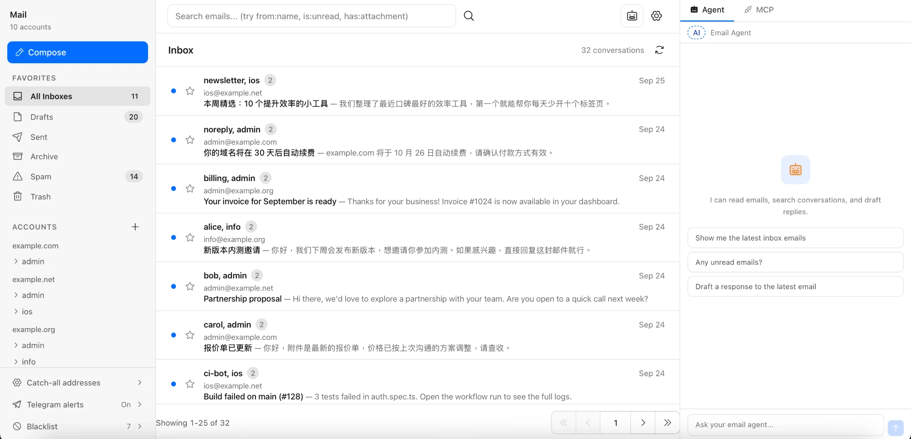
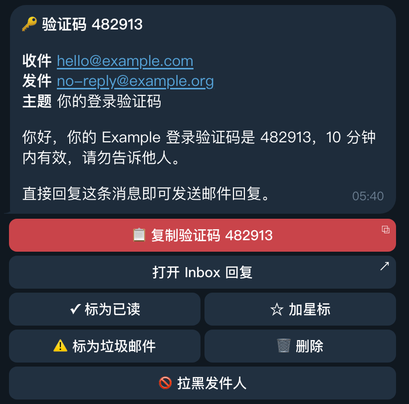

<div align="center">
  <h1>free-domain-email</h1>
  <p><em>完全免费的自定义域名邮箱：多域名、任意前缀收信，在 Telegram 里直接处理邮件，运行在 Cloudflare Workers 上</em></p>
</div>

一个部署就能同时接收多个域名、任意前缀的邮件。新邮件实时推送到 Telegram，回复、标为已读、加星标、删除、拉黑等常用操作直接在 Telegram 里完成，不用每次都登录网页后台。所有邮件都存放在你自己的 Cloudflare 账户里。



*截图为界面改成中文之前的版本。*

> 本项目 fork 自 [cloudflare/agentic-inbox](https://github.com/cloudflare/agentic-inbox)，在上游基础上增加了下面这些功能，并把界面改成了中文。

## 亮点

- **多域名**：一个部署同时接收多个域名的邮件，在 `DOMAINS` 里用英文逗号分隔即可。侧栏按域名分组显示账户，「所有收件箱」合并显示全部邮件
- **泛域名邮箱（任意前缀）**：发往「任意前缀@你的域名」的邮件都能收到，第一封邮件到达时自动创建对应邮箱，不用提前一个个建。每个域名可以在侧栏的 **通配地址** 中单独开关
- **Telegram 新邮件通知**：新邮件实时推送到 Telegram，显示收件邮箱、发件人、主题和正文预览
- **在 Telegram 里直接处理邮件**：通知下方的按钮可以直接标为已读/未读、加星标、删除、标为垃圾邮件、拉黑发件人，每个操作都能撤销；直接回复通知消息，就会以对应邮箱发出邮件回复。常用操作不用再登录网页后台

<p align="center">
  
</p>

## 其他功能

- **两种发信方式**：用 [Resend](https://resend.com) 发信（免费版即可），或者用 Cloudflare Email Service，见[费用与发信方式](#费用与发信方式)
- **垃圾邮件与黑名单**：可以在邮件列表、阅读界面、AI 助手或 MCP（`report_spam`）中举报垃圾邮件。这封邮件和该发件人的其他邮件会移到垃圾邮件，之后该发件人的邮件直接进入垃圾邮件，不会触发自动起草和通知。在侧栏的 **黑名单** 中管理已拉黑的发件人
- **中文界面**：界面、Telegram 通知、日期格式和邮件引用抬头都使用中文
- **完整的邮件客户端**：富文本编辑、按会话归并的回复与转发、文件夹、搜索和附件；有多个邮箱时，写邮件界面可以选择 **发件人**
- **邮箱隔离**：每个邮箱运行在独立的 [Durable Object](https://developers.cloudflare.com/durable-objects/) 中，数据存于 SQLite，附件存于 [R2](https://developers.cloudflare.com/r2/)
- **内置 AI 助手**：基于 [Cloudflare Agents SDK](https://developers.cloudflare.com/agents/) 和 [Workers AI](https://developers.cloudflare.com/workers-ai/)，侧边面板提供 10 个邮件工具，可以阅读、搜索、起草、发送邮件以及举报垃圾邮件；新邮件到达时会自动起草回复，发送前始终需要你确认
- **MCP 服务器**：Claude Code、Cursor 等 AI 工具可以通过 `/mcp` 连接并操作邮箱

## 费用与发信方式

收信完全免费：Email Routing、Workers、Durable Objects、R2 和 Cloudflare Access 都可以在 Cloudflare 免费计划内使用，收信、多域名、任意前缀、Telegram 通知和按钮操作都不花钱，只需要自备域名。AI 助手使用的 Workers AI 在免费计划下有每日额度。

发信（在网页或 Telegram 里回复、写新邮件、转发）二选一：

| 发信方式 | 费用 | 限制 |
| --- | --- | --- |
| **Resend**（推荐） | 免费版 0 元 | 每月 3,000 封、每天 100 封，最多 3 个发信域名；Pro 版每月 20 美元，10 个域名、无每日上限 |
| **Cloudflare Email Service** | Workers Paid 计划每月 5 美元 | 每月含 3,000 封，超出后每千封 0.35 美元；发给账户里已验证的目标地址不收费 |

怎么选：只需要从 3 个以内的域名发信、每天不超过 100 封，用 Resend 免费版，整个项目就完全免费；要从更多域名发信或发信量更大，Cloudflare Email Service 更便宜。

价格以官方页面为准：[Resend 定价](https://resend.com/pricing)、[Cloudflare Email Service 定价](https://developers.cloudflare.com/email-service/platform/pricing/)。

## 部署教程

### 准备工作

- 一个 [Cloudflare](https://dash.cloudflare.com) 账户，免费计划即可
- 一个或多个域名，并且已经接入 Cloudflare（DNS 由 Cloudflare 托管）
- 用 Resend 发信的话，需要一个 [Resend](https://resend.com) 账户
- 需要 Telegram 通知的话，需要一个 Telegram 账号
- 用命令行部署的话，本机需要 [Node.js](https://nodejs.org) 20 或更高版本和 git

### 第 1 步：为每个域名开启 Email Routing

1. 登录 Cloudflare 控制台，选择你的域名。
2. 左侧菜单进入 **Email（电子邮件）→ Email Routing（电子邮件路由）**，点击开始使用。
3. Cloudflare 会提示添加收信需要的 MX 和 SPF 记录，按提示一键添加并启用。
4. 每个要收信的域名都重复一遍。

> ⚠️ 如果这个域名之前在用别的邮箱服务（比如企业邮箱），开启 Email Routing 会替换原来的 MX 记录，原来的邮箱就收不到信了。

### 第 2 步：部署 Worker

**方式 A：一键部署（推荐）**

点击下面的按钮，按提示授权 GitHub 和 Cloudflare。部署流程会在你的 GitHub 里复制一份仓库，并自动创建 R2 存储桶、Durable Objects 和 Workers AI 绑定。

[](https://deploy.workers.cloudflare.com/?url=https://github.com/bovachen/free-domain-email)

部署过程中会让你填写 **DOMAINS**：填入第 1 步开启了 Email Routing 的域名，多个域名用英文逗号分隔，例如 `example.com,example.net`。

**方式 B：命令行部署**

```bash
git clone https://github.com/bovachen/free-domain-email.git
cd free-domain-email
npm install
cp wrangler.jsonc wrangler.local.jsonc
```

编辑 `wrangler.local.jsonc`：

- 把 `vars.DOMAINS` 改成你的域名，多个域名用英文逗号分隔
- 如果想用自己的域名访问网页，比如 `mail.example.com`，加上 `"routes": [{ "pattern": "mail.example.com", "custom_domain": true }]`
- 如果你的 Cloudflare 账号下有多个账户，加上 `"account_id": "你的账户 ID"`

`wrangler.local.jsonc` 已加入 .gitignore，你的真实配置不会被提交到 git。只要这个文件存在，`npm run dev` 和 `npm run deploy` 就会用它代替 `wrangler.jsonc`。

然后登录 Cloudflare、创建 R2 存储桶并部署：

```bash
npx wrangler login
npx wrangler r2 bucket create free-domain-email
npm run deploy
```

部署成功后，终端会打印 Worker 的访问地址（`https://free-domain-email.<你的子域>.workers.dev`）。

> 如果你之前部署过上游的 cloudflare/agentic-inbox，请在 `wrangler.local.jsonc` 里保留原来的 Worker 名和 R2 桶名（`agentic-inbox`）。改名会部署成一个新的 Worker，读不到原有的邮件。

### 第 3 步：开启 Cloudflare Access（必需）

为了不让收件箱暴露在公网上，应用在生产环境强制要求 [Cloudflare Access](https://developers.cloudflare.com/cloudflare-one/policies/access/)，没配置时会直接拒绝访问。

1. 在 Cloudflare 控制台进入 **Workers & Pages**，打开刚部署的 Worker。
2. 进入 **Settings（设置）→ Domains & Routes（域和路由）**，在 workers.dev 地址（或你的自定义域名）旁边开启 [一键 Cloudflare Access](https://developers.cloudflare.com/changelog/post/2025-10-03-one-click-access-for-workers/)。
3. 弹窗会显示 `POLICY_AUD` 和 `TEAM_DOMAIN` 两个值，把它们设置为 Worker 的密钥（secret）：
   - 命令行：分别运行下面两条命令，按提示粘贴对应的值
     ```bash
     npx wrangler secret put POLICY_AUD
     npx wrangler secret put TEAM_DOMAIN
     ```
   - 或者在控制台：Worker → **Settings → Variables and Secrets（变量和机密）** → 添加，类型选 **Secret（密钥）**
4. 开启 Access 时，在 **Authentication policy（身份验证策略）** 里选择谁能登录：**Cloudflare account** 允许这个 Cloudflare 账户的成员登录，**Email domain** 允许指定邮箱域名下的用户登录。之后可以在 Zero Trust 控制台的 Access 应用里修改。

`TEAM_DOMAIN` 可以是 Access 团队地址（`https://<团队名>.cloudflareaccess.com`），也可以是完整的 `.../cdn-cgi/access/certs` 地址。

### 第 4 步：把邮件转给 Worker

对每个域名：

1. 进入 **Email → Email Routing → Routing rules（路由规则）**。
2. 找到 **Catch-all address（Catch-all 地址）**，点击编辑。
3. 操作选 **Send to a Worker（发送到 Worker）**，目标选你部署的 Worker（默认名为 `free-domain-email`），保存并启用。

这样发往这个域名任意地址的邮件都会交给 Worker 处理。

### 第 5 步：配置发信（二选一）

#### 方式 A：Resend（免费版可用）

1. 注册并登录 [Resend](https://resend.com)，进入 **Domains**，点击 **Add Domain**，填入你的域名，例如 `example.com`。发信地址就是网页里的邮箱地址（比如 `admin@example.com`），所以要添加根域名，不要添加子域名。
2. 添加 DNS 记录，两种做法任选一种：
   - **自动**：在域名详情页点击 **Sign in to Cloudflare**，授权后 Resend 会自动写入 DNS 记录。
   - **手动**：在 Cloudflare 的 DNS 设置里添加下面三条记录。记录的值以 Resend 后台显示的为准，名称只填前缀，不要带域名：

     | 类型 | 名称 | 内容 | 其他 |
     | --- | --- | --- | --- |
     | MX | `send` | `feedback-smtp.us-east-1.amazonses.com`（以后台为准） | 优先级 `10` |
     | TXT | `send` | `v=spf1 include:amazonses.com ~all` | |
     | TXT | `resend._domainkey` | `p=...`（后台提供的 DKIM 公钥） | 代理状态：仅 DNS |

   这三条记录都在 `send` 子域和 `resend._domainkey` 上，不会影响第 1 步里 Cloudflare 收信用的根域名 MX 记录。
3. **不要**打开 Resend 里这个域名的 **Receiving（收信）** 开关。收信继续由 Cloudflare Email Routing 负责；在 Resend 里开启收信需要修改根域名的 MX 记录，会导致 Cloudflare 收不到信。
4. 等待域名状态变成 **Verified**，通常几分钟。
5. 进入 **API Keys**，点击 **Create API Key**，权限选 **Sending access**（可以只允许刚才的域名），复制生成的密钥（以 `re_` 开头，只显示一次）。
6. 把密钥保存为 Worker 的密钥 `RESEND_API_KEY`：
   ```bash
   npx wrangler secret put RESEND_API_KEY
   ```
   或者在控制台：Worker → **Settings → Variables and Secrets** → 添加，类型选 **Secret**，名称填 `RESEND_API_KEY`。
7. 在网页里写一封邮件发给你的其他邮箱，确认能收到。

配置了 `RESEND_API_KEY` 之后，所有发信（网页写信、回复、转发、AI 助手、Telegram 里回复）都会走 Resend；删除这个密钥就会切回 Cloudflare Email Service。每个要发信的域名都要在 Resend 里验证，从没验证的域名发信会报错。

#### 方式 B：Cloudflare Email Service

1. 在 Cloudflare 控制台把 Workers 升级到 **Workers Paid** 计划（每月 5 美元）。
2. 按 [Email Service 文档](https://developers.cloudflare.com/email-service/get-started/send-emails/) 为发信域名完成配置。
3. 不需要改代码或配置，Worker 已经带有 `send_email` 绑定（`EMAIL`）。不要设置 `RESEND_API_KEY`。

### 第 6 步：开始使用

1. 打开 Worker 的地址，通过 Cloudflare Access 登录。
2. 创建邮箱：在首页点击 **新建邮箱**，或者直接从别的邮箱给「任意前缀@你的域名」发一封信，第一封信到达时会自动创建对应邮箱（前提是侧栏的 **通配地址** 对这个域名是开启的，默认开启）。
3. 发一封测试邮件回复过去，确认发信正常。

### 第 7 步（可选）：配置 Telegram 通知

1. 在 Telegram 里找到 [@BotFather](https://t.me/BotFather)，发送 `/newbot`，按提示设置机器人名称和用户名，得到机器人的 Token。
2. 打开网页，在侧栏展开 **Telegram 通知**，粘贴 Token，点击 **保存**，再勾选 **启用**。
3. 在 Telegram 里打开你的机器人，发送 `/start`。一分钟内机器人会回复「已绑定这个对话」，说明绑定成功。一定要先勾选 **启用**，否则不会自动绑定。
4. 刷新网页后可以在面板里看到 Chat ID。点击 **测试**，Telegram 里收到测试消息就说明配置成功。

之后每封新邮件都会推送到这个对话，附带操作按钮：标为已读/未读、加星标、删除（移到废纸篓）、标为垃圾邮件、拉黑发件人，每个操作都可以撤销。直接回复通知消息，就会从对应邮箱发出邮件回复（需要先完成第 5 步）。发送 `/block <地址>` 或 `/unblock <地址>` 可以管理黑名单。

默认由 cron 触发器（`wrangler.jsonc` 中的 `* * * * *`）每分钟在 Worker 内部长轮询 Telegram 的 `getUpdates`，所以按钮和回复不需要任何入站路由，也不用改 Access 配置。点击按钮后通常几秒内生效，最慢约一分钟。

通知里的链接默认指向你打开网页时所用的地址；如需改用其他地址，修改面板里的 **收件箱 URL**。

**可选的即时模式**：点击 **连接 Webhook**，把 `https://<你的收件箱地址>/api/telegram/webhook` 注册到 Telegram，并在 Cloudflare Zero Trust 中为这个路径单独添加一个 Access 应用，策略设为对 *Everyone* **Bypass**。Telegram 的服务器无法登录，所以 Worker 用 Telegram 回传的 secret token（`X-Telegram-Bot-Api-Secret-Token`）验证这个路径。注册 Webhook 后轮询会自动暂停。

## 常见问题

**打开网页提示 `Access 令牌无效或已过期`**

通常是 `POLICY_AUD` 或 `TEAM_DOMAIN` 填错了。[把这个 Worker 的 Access 关掉再重新打开](https://developers.cloudflare.com/changelog/post/2025-10-03-one-click-access-for-workers/)，重新调出 Access 弹窗，然后用弹窗里最新的值重新设置这两个密钥。

**打开网页提示 `生产环境必须配置 Cloudflare Access`**

还没完成第 3 步。应用会强制要求 Cloudflare Access，避免收件箱暴露给互联网上的任何人。

**收不到邮件**

- 确认第 4 步的 Catch-all 规则已启用，目标是这个 Worker
- 确认这个域名在 `DOMAINS` 里
- 如果邮箱还不存在，确认侧栏 **通配地址** 里这个域名是开启的；关闭时只接收已创建的邮箱
- 如果设置了 `EMAIL_ADDRESSES`，只有列表里的地址会被接收
- 发件人在黑名单里的邮件会直接进入 **垃圾邮件**

**发信失败**

- 提示 `domain is not verified`：这个域名还没在 Resend 里验证，见第 5 步方式 A
- 用 Resend 免费版时，每天超过 100 封会被拒绝，第二天恢复或升级套餐
- 没有设置 `RESEND_API_KEY` 时走的是 Cloudflare Email Service，向任意地址发信需要 Workers Paid 计划

## 本地开发

```bash
npm install
npm run dev
```

本地开发时不需要 Cloudflare Access。要在本地测试 Resend 发信，把 `.dev.vars.example` 复制为 `.dev.vars` 并填入 `RESEND_API_KEY`。

## 安全说明

按照设计，任何通过了 Cloudflare Access 策略的用户都能访问本应用中的所有邮箱，包括位于 `/mcp` 的 MCP 服务器：通过 MCP 连接的外部 AI 工具（Claude Code、Cursor 等）只要传入 `mailboxId` 参数，就能操作任意邮箱。应用没有按邮箱划分的权限控制，Cloudflare Access 策略是唯一的信任边界。

## 技术栈

- **前端：** React 19、React Router v7、Tailwind CSS、Zustand、TipTap、`@cloudflare/kumo`
- **后端：** Hono、Cloudflare Workers、Durable Objects（SQLite）、R2、Email Routing
- **发信：** Resend 或 Cloudflare Email Service
- **AI 助手：** Cloudflare Agents SDK（`AIChatAgent`）、AI SDK v6、Workers AI（`@cf/moonshotai/kimi-k2.5`）、`react-markdown` + `remark-gfm`
- **鉴权：** Cloudflare Access JWT 校验（本地开发以外的环境必须开启）

## 架构

```
┌──────────────┐     ┌──────────────────┐     ┌─────────────────┐
│   Browser    │────>│  Hono Worker     │────>│  MailboxDO      │
│  React SPA   │     │  (API + SSR)     │     │  (SQLite + R2)  │
│  Agent Panel │     │                  │     └─────────────────┘
└──────┬───────┘     │  /agents/* ──────┼────>┌─────────────────┐
       │             │                  │     │  EmailAgent DO  │
       │ WebSocket   │                  │     │  (AIChatAgent)  │
       └─────────────┤                  │     │ 10 email tools  │
                     │                  │────>│  Workers AI     │
                     └──────────────────┘     └─────────────────┘
```

## 许可证

Apache 2.0，详见 [LICENSE](LICENSE)。
